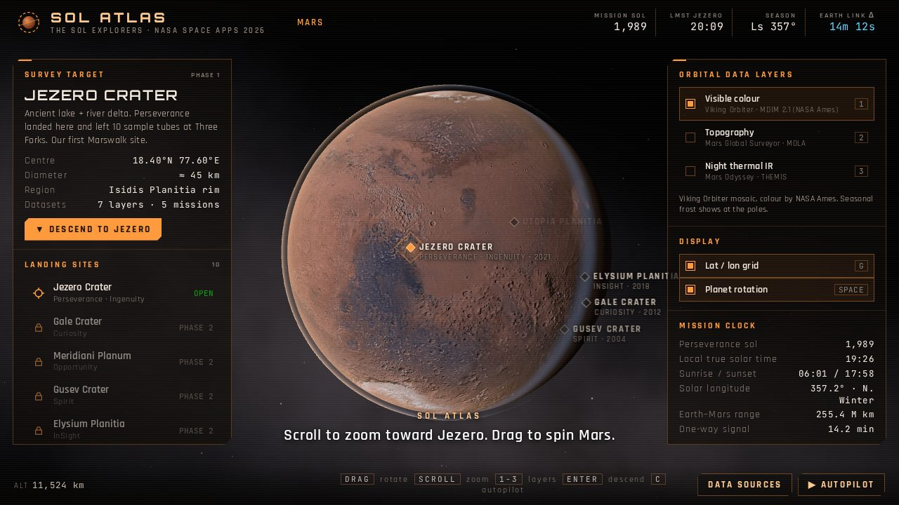
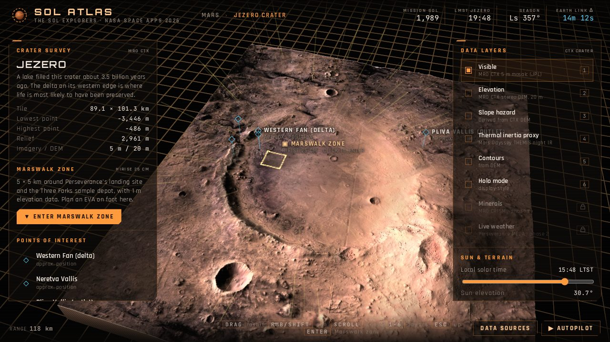
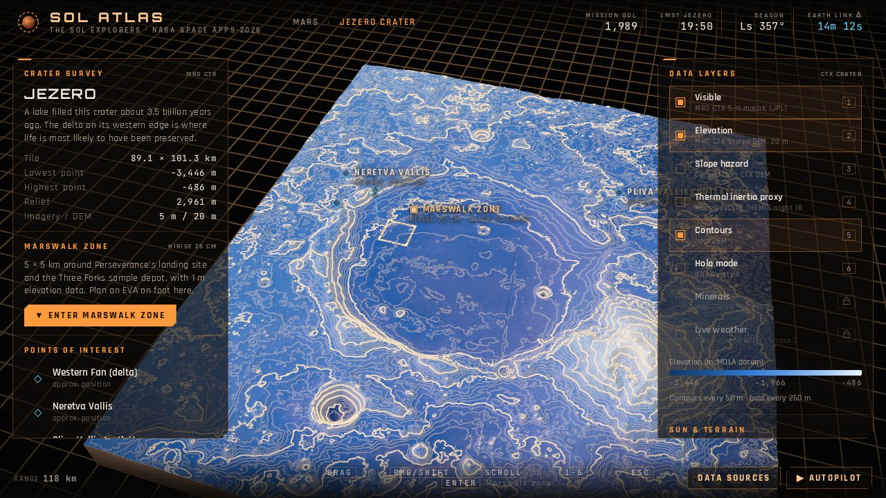
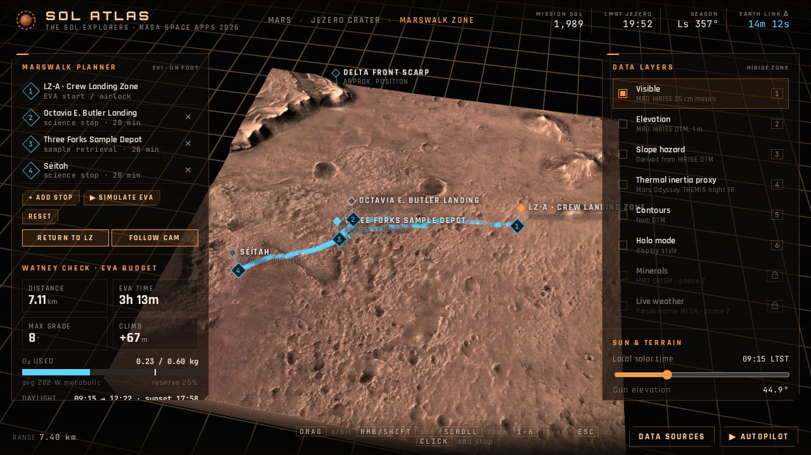
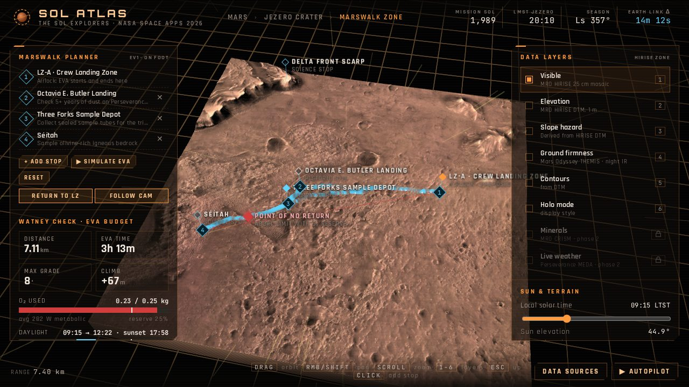
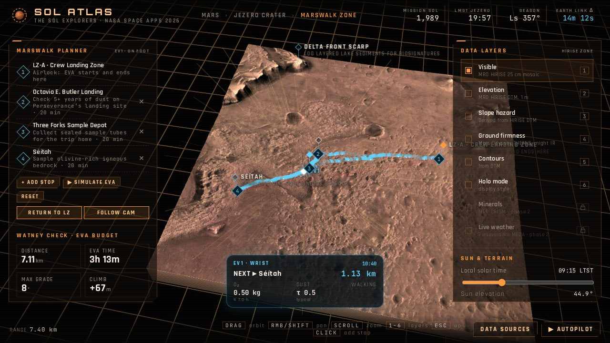
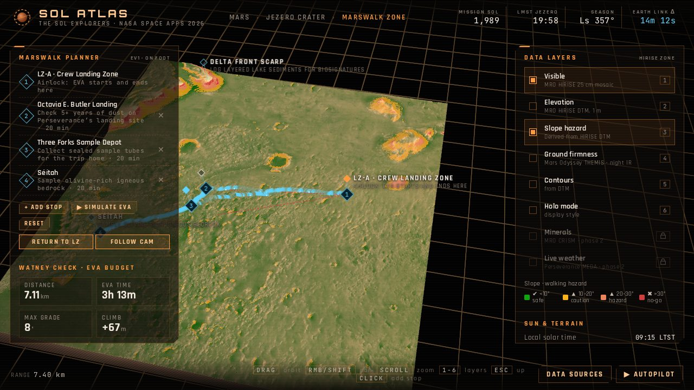

# Sol Atlas

**A layered, game-style Marswalk planner built on real NASA Mars data.**

The SOL Explorers · NASA Space Apps Challenge 2026 · challenge: *Interplanetary Survival Guide: Martian Map*

**Live demo:** https://sol-atlas.netlify.app · **Project log:** [PROJECT_LOG.md](PROJECT_LOG.md)



In *The Martian*, Mark Watney survives by doing the maths himself: oxygen, distance, daylight, terrain. Sol Atlas does that maths for the first crews. It stacks data from five NASA missions on one 3D map, finds the safest route for a walk on foot, and checks whether the astronaut gets home with oxygen to spare.

This is the **phase-1 prototype** made for the 240-second local-judging video. Jezero Crater is the only site unlocked; the other landing sites are marked "phase 2".

---

## Contents

- [How it works](#how-it-works)
- [Data layers](#data-layers)
- [The science behind the numbers](#the-science-behind-the-numbers)
- [Places on the map](#places-on-the-map)
- [Controls](#controls)
- [Phones, tablets and performance](#phones-tablets-and-performance)
- [Recording the pitch video](#recording-the-pitch-video)
- [Run it locally](#run-it-locally)
- [Rebuild the NASA data](#rebuild-the-nasa-data)
- [Deploy](#deploy)
- [Project structure](#project-structure)
- [Limitations and roadmap](#limitations-and-roadmap)
- [Credits](#credits)

---

## How it works

Sol Atlas has three levels. You move between them by scrolling, like zooming from a system map down to a planet surface in a space game.

### 1. Orbit

A rotating Mars with real Viking colour, MOLA relief, a thin dusty atmosphere, Phobos and Deimos. Ten landing sites are marked. Scroll in and the camera locks onto Jezero; scroll again, or click, to descend. A live mission clock shows the Perseverance sol, local time at Jezero, the Martian season and the current Earth–Mars signal delay.

### 2. Jezero Crater

The whole crater (89 × 101 km) as a 3D block, built from the orbital imagery and elevation model NASA prepared for Perseverance. The terrain is lit by the real Sun position, with shadows that move as you drag the time-of-day slider.

| Crater | Elevation + contours |
|---|---|
|  |  |

### 3. Marswalk zone

A 5 × 5 km zone around Perseverance's landing site and the Three Forks sample depot, at 25 cm per pixel on a 1 m elevation model. This is where you plan the walk:

- **Safest route.** Pick stops and Sol Atlas finds the path that uses the least oxygen while avoiding slopes too steep to walk. A red dashed line shows the straight-line path for comparison.
- **The Watney check.** Distance, EVA time, oxygen used, oxygen left at the airlock, and daylight left, ending in **MARSWALK READY**, GO WITH CAUTION or NO-GO.
- **Point of no return.** If the suit can't carry enough oxygen, a red marker shows the last point where turning back still keeps the reserve.
- **EVA flyover.** Simulate the walk with a chase camera and a wrist display (next stop, oxygen left, dust).

| Planned route | Point of no return |
|---|---|
|  |  |

| EVA flyover | Slope hazard |
|---|---|
|  |  |

---

## Data layers

Every layer is real mission data. Nothing is hand-painted.

| Level | Layer | Mission / instrument | Product |
|---|---|---|---|
| Orbit | Visible colour | Viking Orbiters | MDIM 2.1 global mosaic, NASA Ames colour (232 m/px) |
| Orbit | Topography, relief | Mars Global Surveyor · MOLA | MOLA 128/64 ppd merged DEM (463 m/px) |
| Orbit | Night thermal IR | Mars Odyssey · THEMIS | USGS controlled night-IR mosaic (100 m/px) |
| Crater | Visible | MRO · CTX | Mars 2020 Science Investigation CTX orthomosaic, 5 m/px (JPL) |
| Crater | Elevation, slope, contours | MRO · CTX stereo | Mars 2020 Science Investigation CTX DEM, 20 m/px (JPL) |
| Crater + zone | Ground firmness | Mars Odyssey · THEMIS | Night-IR mosaic as a thermal-inertia proxy, 100 m/px |
| Marswalk zone | Visible | MRO · HiRISE | Mars 2020 Terrain-Relative-Navigation orthomosaic, 25 cm/px (USGS) |
| Marswalk zone | Elevation, slope, route | MRO · HiRISE stereo | Mars 2020 TRN DTM, 1 m/px (USGS) |
| Phase 2 | Minerals | MRO · CRISM | not yet: shown as locked |
| Phase 2 | Live weather | Perseverance · MEDA | not yet: the conditions panel shows typical values, labelled "not live" |

"Ground firmness" works like this: rock and coarse grains stay warm through the night, while dust and fine sand cool fast. So night-time infrared brightness tells firm ground from loose ground.

---

## The science behind the numbers

| Feature | How it's calculated | Checked against |
|---|---|---|
| Mars clock | NASA GISS **Mars24** algorithm (Allison & McEwen 2000) | Mars24 reference date; Perseverance landing = sol 0 |
| Earth–Mars signal delay | JPL approximate planetary positions (Keplerian elements, 1800–2050) | 11 min 22 s on landing day, 18 Feb 2021, matching NASA's figure |
| Sun and shadows | Solar declination and hour angle for Jezero; shadows ray-marched through the elevation model on the GPU | Sunrise and sunset shown in the HUD |
| Safest route | A* search on a 512 × 512 grid from the HiRISE DTM. Step cost is **metabolic energy**, so the route minimises oxygen; cells steeper than the walking limit are avoided | Default loop solves in under 40 ms |
| Walking cost | **Pandolf et al. (1977)** load-carriage equation, scaled to Mars gravity (0.38 g) with a pressure-suit penalty; Tobler-style speed vs. grade; 1 L O₂ ≈ 20.1 kJ | Flat walking at 0.9 m/s ≈ 293 W ≈ 0.075 kg O₂ per hour, the same rate our 0.60 kg / 8 h suit assumption is sized on |
| Point of no return | First point on the way out where O₂ used so far + O₂ to walk straight back (plus a 25 % detour allowance) would eat into the reserve | 0.30 kg suit → PNR at Séítah; 0.25 kg → mid-route at 2.98 km |
| Elevations | Heights decoded from the DEMs | Three Forks: −2,570 m vs published −2,568 m |

Default EVA assumptions, all editable in the planner: 75 kg astronaut, 58 kg suit and backpack, 0.60 kg usable O₂ (about 8 h), 25 % reserve, 20° walking-slope limit, 20 min per science stop.

The default plan (LZ-A → Octavia E. Butler Landing → Three Forks → Séítah → LZ-A) comes out at **7.1 km, 3 h 13 min, 0.23 kg of O₂, 62 % margin: MARSWALK READY**.

---

## Places on the map

| Place | Position | Notes |
|---|---|---|
| Octavia E. Butler Landing | 18.4447°N 77.4508°E | Perseverance touchdown, 18 Feb 2021 |
| Three Forks Sample Depot | ≈ 18.4391°N 77.4494°E | 10 sample tubes laid Dec 2022 – Jan 2023. Position from published witness-tube coordinates |
| LZ-A, crew landing zone | 18.4500°N 77.4850°E | **Our proposal**, not a NASA site: flat lava floor, ≥ 2 km from the depot so engine blast can't reach it |
| Séítah, delta front, Belva crater, Neretva Vallis, Pliva Vallis, crater rim | approx. | Placed by eye on the CTX and HiRISE mosaics |
| Acidalia Planitia "Ares III" | 31.2°N 28.5°W | Fiction: Mark Watney's base in *The Martian* (Andy Weir) |

---

## Controls

| | Orbit | Crater / Marswalk zone |
|---|---|---|
| Drag | spin the planet | orbit the camera |
| Right-drag or Shift-drag | | pan |
| Scroll | zoom; locks onto Jezero when close | zoom toward the cursor. Keep scrolling out to go up a level |
| Click | Jezero, or the lock-on, to descend | the Marswalk zone to enter it. In the zone, click a named place (e.g. Three Forks) to add it as a stop, or press **+ ADD STOP** and click anywhere |
| Keys | `1`–`3` layers · `G` grid · `Space` rotation · `Enter` descend | `1`–`6` layers · `WASD` pan · `Enter` enter zone · `Esc` go up · `Space` run the EVA simulation |
| Anywhere | `C` autopilot · `H` hide HUD · `K` captions on/off | |
| Touch | drag to spin · pinch to zoom · tap Jezero to descend | drag to orbit · pinch to zoom · two-finger drag to pan · tap to select |

On phones, the side panels open as a sheet from the tabs at the bottom of the screen (**JEZERO / CRATER / PLANNER** and **LAYERS**). Tap the map to close the sheet.

---

## Phones, tablets and performance

Sol Atlas picks a quality level for each device when it loads. You can force one by adding it to the URL:

| Level | Chosen for | What changes | Force it with |
|---|---|---|---|
| High | desktops and laptops | 8k globe, full-resolution terrain, up to 2× sharpness | `?q=high` |
| Medium | tablets, 4-core or low-memory laptops | 4k globe, full terrain, up to 1.5× sharpness | `?q=medium` |
| Low | phones | half-resolution textures (about 11 MB download instead of 40 MB), terrain meshes with 4× fewer points, 30 fps cap, no screen overlays | `?q=low` |

On every level:
- **Adaptive resolution** lowers the render resolution when frames get slow and raises it again when there's headroom.
- **Shadows** are baked into a texture only when the sun or the relief changes, instead of being re-calculated for every pixel on every frame.
- Everything is decoded, compiled and uploaded behind the loading screen, so the zoom transitions never stall on first use.

---

## Recording the pitch video

Press **`C`** (or **▶ AUTOPILOT**) for a scripted fly-through of about two minutes, with captions. It follows the WHAT and SO WHAT sections of our pitch script:

1. Orbit, then the MOLA and THEMIS layers.
2. Lock onto Jezero and descend.
3. Crater: elevation and contours, ground firmness, slope hazard.
4. Marswalk zone: the safest route.
5. "What if the suit carried only 0.25 kg of O₂?" The point of no return appears and the call is NO-GO.
6. EVA flyover with the wrist display.
7. Pick Three Forks: the route draws and **MARSWALK READY** shows.
8. Holo-mode end card.

Tips:
- Press `K` to hide the captions if you're recording your own voiceover, and `H` to hide the HUD for clean B-roll.
- Any click or scroll hands control back to you.
- Record at 1920 × 1080 with OBS, or with the Xbox Game Bar (`Win + Alt + R`).

---

## Run it locally

You need [Node.js](https://nodejs.org) 20 or newer and a desktop browser with a graphics card (Chrome, Edge or Firefox).

```bash
git clone https://github.com/saracen66/the-sol-explorers
cd the-sol-explorers
npm install
npm run dev          # opens http://localhost:5173
```

The processed NASA data is already in the repo (`public/data/`, about 40 MB), so you don't need Python to run the app.

Quality is picked automatically; see [Phones, tablets and performance](#phones-tablets-and-performance) to force a level.

Production build:

```bash
npm run build        # static site in dist/
npm run preview      # serve dist/ at http://localhost:4173
```

---

## Rebuild the NASA data

`scripts/build_data.py` downloads the source data from the public USGS Astrogeology archive (`asc-pds-services` on AWS S3) and bakes the textures and heightmaps in `public/data/`. It streams only the parts it needs. For example, the largest source is a 3.4 GB HiRISE mosaic, and the script reads just the 5 × 5 km zone.

```bash
pip install rasterio numpy pillow scipy
npm run data                           # everything (a few minutes)
python3 scripts/build_data.py crater   # or one stage: global | region | crater | site | lite
```

Downloads are cached in `.cache/`, which is git-ignored. The `lite` stage writes the half-resolution phone textures to `public/data/lite/` and a 4k globe map for medium-quality devices. Heightmaps are stored as PNG images: each 16-bit height is split across the red and green channels (height = R × 256 + G), so any static web host can serve them without loss.

---

## Deploy

The site is set up for Netlify with [`netlify.toml`](netlify.toml): it builds with `npm run build` and publishes `dist/`.

**Netlify site:** `sol-atlas` → https://sol-atlas.netlify.app

To publish from GitHub, with automatic redeploys on every push:

1. Open https://app.netlify.com/projects/sol-atlas.
2. Go to **Project configuration → Build & deploy → Continuous deployment → Link repository**.
3. Choose GitHub → `saracen66/the-sol-explorers`.
4. Pick the branch to publish (`main` once the work is merged). Build settings are read from `netlify.toml`.

To deploy by hand from your own computer:

```bash
npm install -g netlify-cli
netlify login
netlify link --id 3cde891d-2654-4f7a-b31d-30e5ad235ca8
netlify deploy --build --prod
```

`dist/` also works on GitHub Pages or any other static host, because all paths are relative.

---

## Project structure

```
index.html              HUD skeleton (panels, loader, overlays)
netlify.toml            Netlify build + cache headers
vite.config.js          Vite config (relative base path)
src/
  main.js               app: level transitions (orbit ⇄ crater ⇄ zone), input, render loop
  styles.css            HUD styling
  orbit/                Mars globe: planet shader (layers, zoom-in detail, relief, lock-on rings),
                        atmosphere, moons, stars
  terrain/              TerrainView: 3D terrain, layer shader, GPU shadows, contours, holo mode, camera
                        Planner: stops, A* routes, EVA budget, point of no return, EVA flyover
                        pathfinding.js (A*), eva.js (metabolic + O₂ model)
  ui/                   HUD panels and legends, elevation-profile chart, labels pinned to 3D points
  lib/                  marstime.js (Mars24, signal delay, sun position), geo.js
  core/                 asset loader, quality levels + adaptive resolution, scene crossfade, autopilot
  data/places.js        landing sites, points of interest, default Marswalk plan
scripts/build_data.py   NASA/USGS → web data pipeline
public/data/            processed textures + heightmaps + manifest.json (lite/ = phone versions)
docs/screenshots/       images used in this README
PROJECT_LOG.md          full record of how the project was built
```

---

## Limitations and roadmap

**Known limitations in phase 1**
- Only Jezero is unlocked.
- The CRISM mineral layer and live MEDA weather aren't in yet.
- Some place positions are approximate (see [Places](#places-on-the-map)).
- The EVA model is a planning estimate, not flight-certified. Its assumptions are listed in the planner.

**Next**
- More sites, including ice-rich plains from NASA's SWIM ice-mapping project.
- CRISM minerals.
- Live MEDA weather.
- Dust-storm alerts from orbit.
- An offline mode for suits and rovers.

---

## Credits

**Team:** The SOL Explorers, NASA Space Apps Challenge 2026.

**Data:**
- NASA / JPL-Caltech / University of Arizona (HiRISE)
- NASA / JPL-Caltech / MSSS (CTX)
- NASA / JPL-Caltech / Arizona State University (THEMIS)
- NASA / GSFC (MOLA)
- NASA / USGS (Viking MDIM 2.1, NASA Ames colour)
- USGS Astrogeology Science Center (mosaics and DTMs)
- Mars 2020 science maps: Mangold et al. (2021), *Science*

NASA imagery is not copyrighted. No NASA logos are used.

**Built with:** [three.js](https://threejs.org), [Vite](https://vitejs.dev) and Python ([rasterio](https://rasterio.readthedocs.io), NumPy, Pillow, SciPy). Fonts: Rajdhani, Orbitron, JetBrains Mono.
